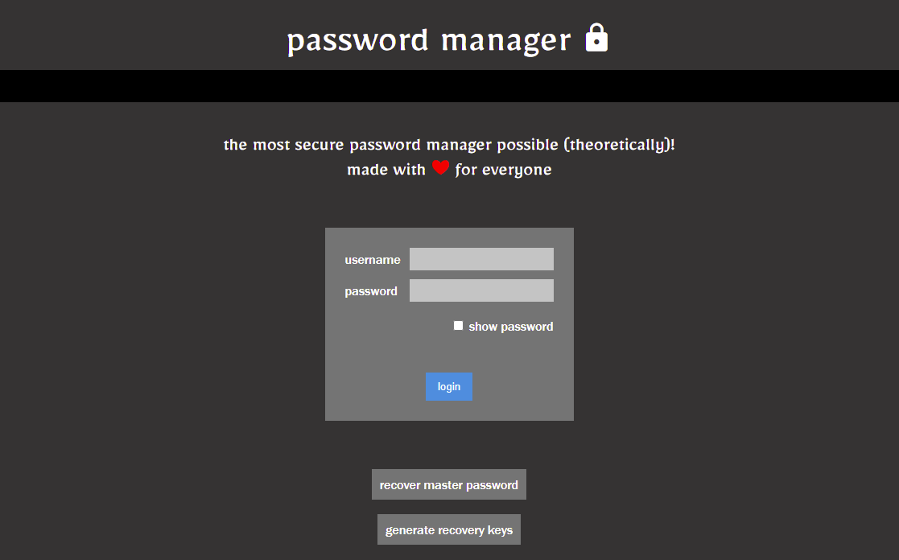
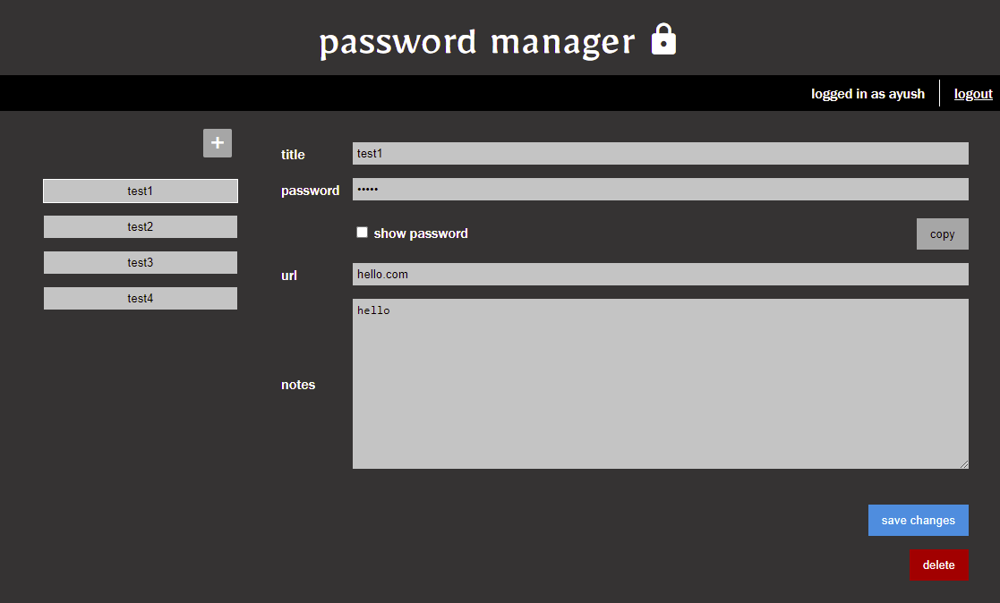
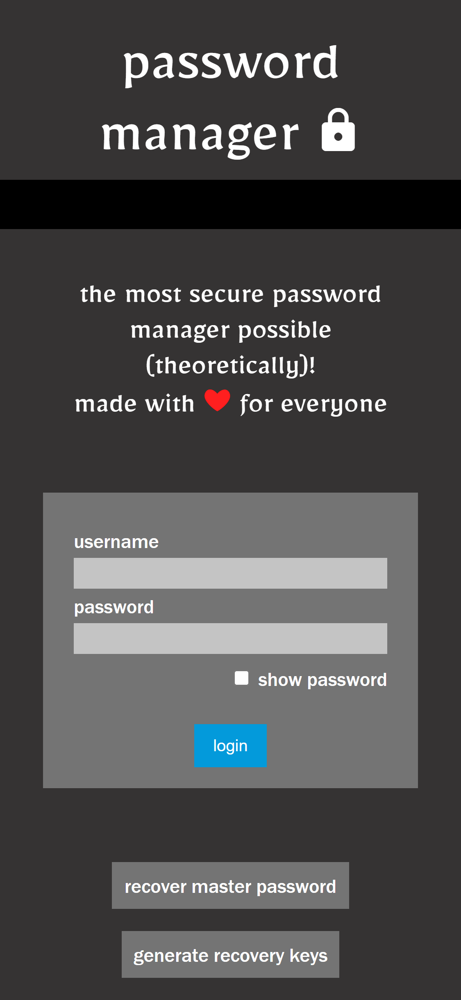
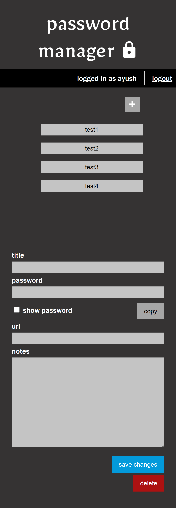

# Password Manager

   

The most secure way to manage passwords online (theoretically).

## Try out Password Manager

### [Live](https://ayushrawal.github.io/password-manager)

## Screenshots

  
  
&nbsp;&nbsp;

## About Password Manager 📖

I have always struggled with my passwords. I use capital letters, numbers, special symbols in my passwords and keep them unrelated to myself for maximum security and peace of mind, but that also makes them hard to remember, especially when there are so many of them. 
Sure, I could use any of the password managers available out there, but cyber attacks on those are not a rare sight. 
So, I built this project. 
The best way to store passwords of multiple users, I thought, was to hash them using their master password.

But, this approach has a few disadvantages too. 
If a user forgets his/her master password, he/she loses all the passwords, i.e., there can be no "Forgot Password" feature.

To help with that, I am using [Shamir's Secret Sharing](https://en.wikipedia.org/wiki/Secret_sharing#Shamir's_scheme) algorithm.

User can generate recovery keys, any 3 of which can be used to retrieve the master password later.

This is the web frontend of the project.

## Also check out

The backend repository: [password-manager-backend](https://github.com/AyushRawal/password-manager-backend).

I have also made a CLI client for this: [passman](https://github.com/AyushRawal/password-manager-cli).

## Support 🙏

Please drop a star ⭐ if you like this project.

_**Note :** Please feel free to ask for a feature or report any bug by opening an issue._

 
Made with ❤️ for 🌏 Everyone

